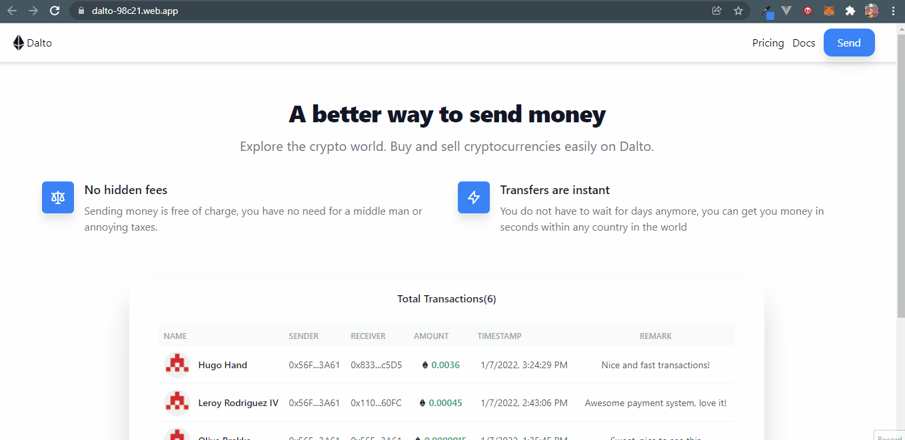

# Building an Ethereum Transaction App with React and Solidity

Read the full tutorial here: [**>> Building an Ethereum Transaction App with React and Solidity**](https://daltonic.github.io)

This example shows Building an Ethereum Transaction App with React and Solidity:



<center><figcaption>Dalto Interface</figcaption></center>

## Technology

This demo uses:

- Metamask
- Remix Editor
- Hardhat
- Alchamy
- ReactJs
- Tailwind CSS
- Solidity
- EthersJs
- Faucet
- Vite

## Running the demo

To run the demo follow these steps:

1. Clone the github project on the terminal `git clone https://github.com/Daltonic/dalto`.
2. Follow this [tutorial](https://dev.to/daltonic/building-an-ethereum-transaction-app-with-react-and-solidity-part-two-2pg2) get your keys together.
2. Open the project in **VS Code >> smart_contract >> hardhat.config.js** and replace its content with the codes below.
   ```js
   require('@nomiclabs/hardhat-waffle')
    module.exports = {
    solidity: '0.8.0',
    networks: {
        rinkeby: {
        url: '<YOUR_ALCHEMY_APP_URL_GOES_HERE>',
        accounts: [
            '<YOUR_RINKEBY_ACCOUNT_PRIVATE_KEY_GOES_HERE>',
        ],
        },
    },
   }
   ```
3. Open client >> src >> utils >> constants.js and replace the content with yours.
4. ```js
    import abi from './Transactions.json'
    export const contractAbi = abi.abi
    export const contractAddress = '<YOUR_DEPLOYED_SMART_CONTRACT_ADDRESS_GOES_HERE>'
   ```
5. On the terminal, CD to the smart_contract directory and run the following code.
   ```sh
   yarn install
   yarn hardhat run scripts/deploy.js --network rinkeby
   ```
6. On the smart_contract directory goto **smart_contract >> artifacts >> contracts >> Transactions.sol >> Transactions.json.** Copy the entire code and paste them in **client >> src >> utils >> Transactions.json file.**

7. On the terminal, CD to the client directory and run the following code.
   ```sh
   yarn install
   yarn dev
   # spins it up on the browser...
   ```
8. Open the browser and visit the url on the terminal.

<br/>

Questions about running the demo? [Open an issue](https://github.com/Daltonic/dalto/issues). We're here to help ✌️

## Useful links

- 🏠 [Website](https://daltonic.github.io/)
- ⚽ [Metamask](https://metamask.io/)
- 🚀 [Remix Editor](https://remix.ethereum.org/)
- 💡 [Hardhat](https://dev.tohttp//)
- 📈 [Alchamy](https://www.alchemy.com/)
- 🔥 [ReactJs](https://reactjs.org/)
- 😊 [Tailwind CSS](https://www.alchemy.com/)
- 🐻 [Solidity](https://soliditylang.org/)
- 👀 [EthersJs](https://docs.ethers.io/v5/)
- 🎅 [Faucet](https://faucets.chain.link/rinkeby)
- 🤖 [Vite](https://vitejs.dev/)
- ✨ [Live Demo](https://dalto-98c21.web.app/)